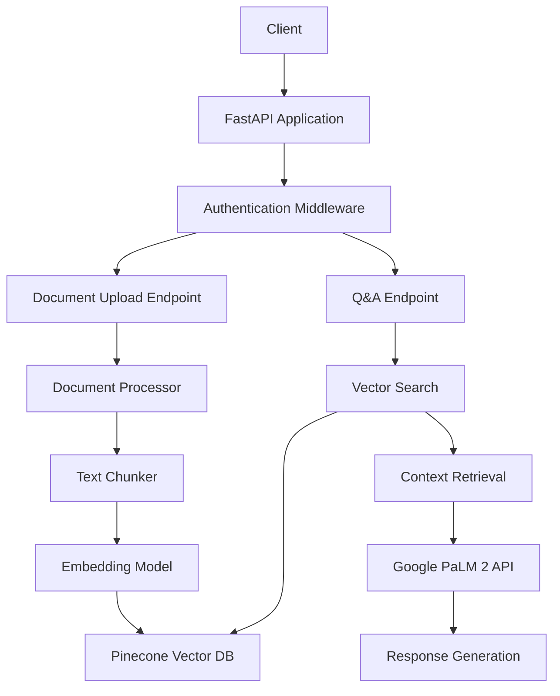

# Fintech Document Q&A API using RAG

A production-grade API service that enables users to upload financial documents (PDF/CSV/TXT) and ask natural language questions about them. The system uses Retrieval-Augmented Generation (RAG) architecture with Google PaLM 2 API and Pinecone vector search to provide intelligent document analysis.

## 🚀 Features

- **Document Processing**: Upload and parse PDF, CSV, and TXT financial documents
- **Natural Language Q&A**: Ask questions in plain English about uploaded documents
- **Vector Search**: Efficient similarity search using Pinecone vector database
- **LLM Integration**: Google Vertex AI PaLM 2 for generating contextual responses
- **Production Ready**: Docker containerization, Kubernetes deployment, CI/CD pipeline
- **Security**: API key authentication and secure secret management
- **Scalability**: Horizontal pod autoscaling and load balancing
- **Monitoring**: Health checks and comprehensive logging

## 🏗️ Architecture



## 🛠️ Tech Stack

- **API Framework**: FastAPI with async support
- **LLM**: Google Vertex AI PaLM 2 (Text Bison)
- **Vector Database**: Pinecone (cloud-hosted)
- **RAG Orchestration**: LangChain
- **Document Processing**: PyMuPDF, Pandas
- **Embeddings**: Sentence Transformers (all-MiniLM-L6-v2)
- **Containerization**: Docker
- **Orchestration**: Kubernetes
- **CI/CD**: GitHub Actions
- **Authentication**: Bearer token (API key)

## 📋 Prerequisites

- Python 3.11+
- Docker and Docker Compose
- Kubernetes cluster (for deployment)
- Google Cloud Platform account with Vertex AI API enabled
- Pinecone account and API key
- Git

## 🚀 Quick Start

### 1. Clone the Repository

```bash
git clone <repository-url>
cd fintech-rag-api
```

### 2. Environment Setup

Create environment file:

```bash
# Copy and modify environment variables
cp .env.example .env

# Edit .env with your credentials
API_KEY=your-secure-api-key
GCP_PROJECT_ID=your-gcp-project-id
GOOGLE_APPLICATION_CREDENTIALS=./config/service-account-key.json
PINECONE_API_KEY=your-pinecone-api-key
PINECONE_ENVIRONMENT=your-pinecone-environment
```

### 3. Google Cloud Setup

1. Create a service account in Google Cloud Console
2. Enable Vertex AI API
3. Download service account JSON key
4. Place the key file at `./config/service-account-key.json`

### 4. Pinecone Setup

1. Sign up at [Pinecone](https://www.pinecone.io/)
2. Create a new index with:
   - Dimension: 384
   - Metric: Cosine similarity
3. Note your API key and environment

### 5. Local Development

```bash
# Install dependencies
pip install -r requirements.txt

# Run the application
python -m uvicorn app.main:app --host 0.0.0.0 --port 8000 --reload

# Access the API documentation
open http://localhost:8000/docs
```

### 6. Docker Deployment

```bash
# Build the Docker image
docker build -t fintech-rag-api .

# Run with docker-compose
docker-compose up -d

# Check logs
docker-compose logs -f
```

## 📖 API Usage

### Authentication

All endpoints require Bearer token authentication:

```bash
Authorization: Bearer your-api-key
```

### Upload Document

```bash
curl -X POST "http://localhost:8000/upload" \
  -H "Authorization: Bearer your-api-key" \
  -F "file=@sample_docs/bank_statement.txt"
```

Response:
```json
{
  "document_id": "550e8400-e29b-41d4-a716-446655440000",
  "filename": "bank_statement.txt",
  "status": "success",
  "message": "Document uploaded and processed successfully"
}
```

### Ask Questions

```bash
curl -X POST "http://localhost:8000/ask" \
  -H "Authorization: Bearer your-api-key" \
  -H "Content-Type: application/json" \
  -d '{
    "question": "What is the current account balance?",
    "document_id": "550e8400-e29b-41d4-a716-446655440000"
  }'
```

Response:
```json
{
  "answer": "The current account balance is $4,206.75 as of March 31, 2024.",
  "question": "What is the current account balance?",
  "document_id": "550e8400-e29b-41d4-a716-446655440000",
  "sources": [
    {
      "text": "Current Balance: $4,206.75",
      "metadata": {
        "filename": "bank_statement.txt",
        "chunk_index": 2
      }
    }
  ],
  "confidence_scores": [0.95]
}
```

### Health Check

```bash
curl -X GET "http://localhost:8000/health"
```

## 📁 Project Structure

```
fintech-rag-api/
├── app/
│   ├── main.py              # FastAPI application and endpoints
│   ├── rag_pipeline.py      # RAG pipeline with LangChain + Pinecone
│   └── google_llm.py        # Vertex AI PaLM 2 integration
├── config/
│   └── config.yaml          # Application configuration
├── sample_docs/             # Sample financial documents for testing
│   ├── bank_statement.txt
│   ├── credit_card_transactions.csv
│   ├── loan_agreement.txt
│   └── README.md
├── test/
│   └── test_api.py          # Comprehensive test suite
├── .github/
│   └── workflows/
│       └── ci-cd.yml        # GitHub Actions CI/CD pipeline
├── Dockerfile               # Production-ready Docker image
├── docker-compose.yml       # Local development setup
├── k8s-deployment.yaml      # Kubernetes deployment configuration
├── requirements.txt         # Python dependencies
└── README.md               # This file
```

## 🧪 Testing

Run the comprehensive test suite:

```bash
# Install test dependencies
pip install pytest pytest-asyncio pytest-cov

# Run all tests
pytest test/ -v

# Run with coverage
pytest test/ -v --cov=app --cov-report=html

# Run specific test class
pytest test/test_api.py::TestDocumentUpload -v
```

## 🐳 Docker Deployment

### Building the Image

```bash
# Build production image
docker build -t fintech-rag-api:latest .

# Build with specific tag
docker build -t fintech-rag-api:v1.0.0 .
```

### Running with Docker Compose

```bash
# Start all services
docker-compose up -d

# View logs
docker-compose logs -f app

# Stop services
docker-compose down
```

## ☸️ Kubernetes Deployment

### Prerequisites

- Kubernetes cluster (local or cloud)
- kubectl configured
- Container registry access

### Deploy to Kubernetes

1. **Create Secrets**:

```bash
# Create API secrets
kubectl create secret generic fintech-rag-secrets \
  --from-literal=API_KEY=your-api-key \
  --from-literal=GCP_PROJECT_ID=your-project-id \
  --from-literal=PINECONE_API_KEY=your-pinecone-key \
  --from-literal=PINECONE_ENVIRONMENT=your-pinecone-env \
  -n fintech-rag

# Create GCP service account secret
kubectl create secret generic gcp-service-account-key \
  --from-file=service-account-key.json=./config/service-account-key.json \
  -n fintech-rag
```

2. **Deploy Application**:

```bash
# Apply all Kubernetes manifests
kubectl apply -f k8s-deployment.yaml

# Check deployment status
kubectl get pods -n fintech-rag

# Check service status
kubectl get services -n fintech-rag
```

3. **Scale the Application**:

```bash
# Manual scaling
kubectl scale deployment fintech-rag-api --replicas=5 -n fintech-rag

# Check HPA status
kubectl get hpa -n fintech-rag
```

## 🔄 CI/CD Pipeline

The project includes a comprehensive GitHub Actions workflow that:

1. **Testing**: Runs unit tests, linting, and security scans
2. **Building**: Creates multi-architecture Docker images
3. **Security**: Vulnerability scanning with Trivy
4. **Deployment**: Automated deployment to staging and production
5. **Notifications**: Slack notifications for deployment status

### Setup GitHub Actions

1. Configure repository secrets:
   - `KUBE_CONFIG_STAGING`: Kubernetes config for staging
   - `KUBE_CONFIG_PRODUCTION`: Kubernetes config for production
   - `SLACK_WEBHOOK_URL`: Slack webhook for notifications

2. Push to trigger pipeline:
   - `develop` branch → deploys to staging
   - Create release → deploys to production

## 📊 Sample Questions

Try these questions with the sample documents:

### Bank Statement
- "What is the current account balance?"
- "How much was spent on fees this month?"
- "What was the largest transaction?"
- "What is the interest rate?"

### Credit Card Transactions
- "What was the total spent on entertainment?"
- "Which merchant had the highest transaction?"
- "How many restaurant transactions were made?"
- "What fees were charged?"

### Loan Agreement
- "What is the monthly payment amount?"
- "What is the interest rate?"
- "What happens if I default on the loan?"
- "How long is the loan term?"

## 🔧 Configuration

### Environment Variables

| Variable | Description | Required |
|----------|-------------|----------|
| `API_KEY` | API authentication key | ✅ |
| `GCP_PROJECT_ID` | Google Cloud project ID | ✅ |
| `GOOGLE_APPLICATION_CREDENTIALS` | Path to GCP service account JSON | ✅ |
| `PINECONE_API_KEY` | Pinecone API key | ✅ |
| `PINECONE_ENVIRONMENT` | Pinecone environment | ✅ |
| `PORT` | Server port (default: 8000) | ❌ |
| `LOG_LEVEL` | Logging level (default: INFO) | ❌ |

### Configuration File

Modify `config/config.yaml` to adjust:
- Model parameters (temperature, max tokens)
- Chunk size and overlap for document processing
- Vector search parameters
- Storage directories

## 🔍 Monitoring and Logging

### Health Checks

The API provides comprehensive health monitoring:

```bash
# Check overall health
curl http://localhost:8000/health
```

Response includes status of:
- Pinecone connection
- Embedding model
- LLM client
- Overall system status

### Logging

Structured logging with configurable levels:
- Application logs: `./logs/api.log`
- Request/response logging
- Error tracking and debugging

## 🚨 Troubleshooting

### Common Issues

1. **Pinecone Connection Failed**:
   - Verify API key and environment
   - Check network connectivity
   - Ensure index exists with correct dimensions

2. **Google Cloud Authentication Error**:
   - Verify service account JSON file path
   - Check Vertex AI API is enabled
   - Ensure proper IAM permissions

3. **Document Processing Failed**:
   - Check file format is supported
   - Verify file size under limit
   - Ensure proper encoding

4. **Out of Memory Errors**:
   - Increase container memory limits
   - Reduce chunk size in configuration
   - Implement batch processing

### Debug Mode

Enable debug logging:

```bash
export LOG_LEVEL=DEBUG
python -m uvicorn app.main:app --reload
```

## 🤝 Contributing

1. Fork the repository
2. Create a feature branch (`git checkout -b feature/amazing-feature`)
3. Commit your changes (`git commit -m 'Add amazing feature'`)
4. Push to the branch (`git push origin feature/amazing-feature`)
5. Open a Pull Request

### Development Guidelines

- Write comprehensive tests for new features
- Follow PEP 8 style guidelines
- Update documentation for API changes
- Ensure Docker builds successfully

## 📄 License

This project is licensed under the MIT License - see the [LICENSE](LICENSE) file for details.

## 🙏 Acknowledgments

- [FastAPI](https://fastapi.tiangolo.com/) for the excellent web framework
- [LangChain](https://python.langchain.com/) for RAG pipeline orchestration
- [Pinecone](https://www.pinecone.io/) for vector database services
- [Google Cloud](https://cloud.google.com/) for Vertex AI services
- [Sentence Transformers](https://www.sbert.net/) for embedding models

## 📞 Support

For support and questions:
- Create an issue in the GitHub repository
- Check the [troubleshooting section](#-troubleshooting)
- Review the API documentation at `/docs` endpoint

---

**Built with ❤️ for the Fintech industry** 